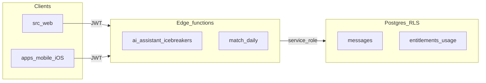

# Security remediation (RLS, IDOR, entitlements, rate limits)

Versioned copy of the remediation plan for the MĀĀK codebase (web + iOS/Expo mobile). Keep in sync when the plan changes.

**Drift, deploy, secrets och MCP-rutiner:** [SUPABASE_DEPLOY.md](./SUPABASE_DEPLOY.md) · **Löpande underhåll:** [SECURITY_MAINTENANCE.md](./SECURITY_MAINTENANCE.md) · **Release-checklista:** [SECURITY_RELEASE_GATE.md](./SECURITY_RELEASE_GATE.md)

## Checklist (high level)

- [x] **migration-rls:** New Supabase migration: fix `messages` SELECT/INSERT, `matches` SELECT; decide and apply `profiles` SELECT (match visibility).
- [x] **entitlements:** Consolidate subscription tier (migration + RLS/triggers); remove client writes from `useSubscription` (web); align mobile if subscription UI shares the same API.
- [x] **usage-table:** Server-only usage/rate_limit storage; refactor `generate-followups`; tighten `icebreaker_analytics` policies.
- [x] **shared-ratelimit:** DB-backed rate limit + IP scopes in `_shared`; wire `ai-assistant`, `generate-icebreakers`, `generate-followups`.
- [x] **idor-edge:** Match checks in `ai-assistant`; `generate-icebreakers` bound to `matchId` + server-derived peer id; align web + `apps/mobile` invoke payloads.
- [x] **send-email-match-daily:** Harden `send-email` (JWT + allowlist); gate or remove `match-daily` service-role bearer in prod.
- [x] **budget-cap:** Env-driven global (and optional per-user) AI caps before upstream calls.
- [x] **verify:** Extend RLS tests; smoke web + iOS (Expo); lint + web build + mobile bundle.

---

## Scope: hela appen (web + mobil, särskilt iOS)

- **En backend:** Alla åtgärder i Supabase (RLS, migreringar, Edge Functions) gäller **både** webb och mobil. iOS-appen (Expo under `apps/mobile/`) anropar samma `supabase.functions.invoke` och PostgREST som webben—säkerhetsfixar i Edge/DB skyddar **alla** klienter.
- **Mobil-specifika ytor att verifiera efter ändringar:**
  - Matchning / dagliga matcher: `apps/mobile/hooks/useMatches.ts` (`match-daily`, `generate-icebreakers`).
  - Chatt / isbrytare: `apps/mobile/components/chat/ChatThread.tsx` (`messages` insert, `generate-icebreakers`).
  - Rapporter / överklaganden / e-post: `apps/mobile/components/support/ReportFormRN.tsx`, `AppealRN.tsx` (`send-email`).
  - Match-status: `apps/mobile/hooks/useMatchStatus.ts`.
  - Profiler / personlighet / gruppchatt: t.ex. `MatchProfileScreen.tsx`, `GroupChatRoom.tsx`—påverkas av RLS för `profiles`, `messages`, `matches`, `group_messages`.
- **Prenumeration / tier i mobil:** `src/hooks/useSubscription.ts` används idag i webb-repo; om iOS senare läser samma tabeller måste **samma** server-auktoritativa modell gälla (inga client-side inserts av tier). Eventuell delad hook eller tunn Edge `get-subscription` ska dokumenteras så mobil och webb inte divergerar.
- **iOS-härdning:** Inga hemligheter i `EXPO_PUBLIC_*` utöver anon/public key. **Supabase Auth-session** lagras i **`expo-secure-store`** via `apps/mobile/contexts/SupabaseProvider.tsx`. `AsyncStorage` används endast för icke-känsliga preferenser (språk, celebration-flaggor m.m.).

## Context

The audit matches the repo: `supabase/migrations/20260113100300_rls_all_policy_fix.sql` weakened `messages` and `matches` policies versus `supabase/migrations/20260109220802_complete_schema_setup.sql`. `supabase/RLS_AND_SCHEMA_ALIGNMENT.sql` documents the intended `messages` SELECT fix but it was never promoted to a forward migration. `supabase/functions/ai-assistant/index.ts` and `generate-icebreakers` fetch arbitrary `matchedUserId` with the service role; `generate-followups` is the reference pattern.

## Phase 1: RLS corrections (new migration)

Add a **new dated migration** under `supabase/migrations/` (do not edit old migrations in place). Apply:

1. **`public.messages`**
   - **SELECT**: participant-based policy (same as `complete_schema_setup` / `RLS_AND_SCHEMA_ALIGNMENT.sql` lines 124–133).
   - **INSERT**: restore `WITH CHECK` that `auth.uid() = sender_id` **and** `EXISTS` match row where caller is `user_id` or `matched_user_id` (as in original schema).
   - **UPDATE**: keep “sender can update own” but ensure it does not broaden beyond original intent; align with `complete_schema_setup` (`Senders can update their own messages`).

2. **`public.matches`**
   - **SELECT**: restore `auth.uid() = user_id OR auth.uid() = matched_user_id` (drop the `user_id`-only variant from `13100300`).

3. **`public.profiles` SELECT (product decision)**
   - `20260127100200_fix_rls_policies.sql` locked SELECT to `id = auth.uid()` only. If the app still loads match profiles via direct `profiles` queries, either:
     - **Option A (recommended for dating UX):** reinstate “own or match” SELECT using the `matches` union pattern from `RLS_AND_SCHEMA_ALIGNMENT.sql` lines 108–118, or
     - **Option B:** keep strict profile RLS and change **both** web and mobile to use an existing safe RPC/view (e.g. `match_candidate_profiles` / `can_view_profile_for_matching` if applicable—verify callers in `src/` and `apps/mobile/` before choosing B).

4. **Verify after deploy:** run or extend `supabase/tests/test_rls_policies.sql` with cases for: read message as **recipient**; **cannot** insert into another match; both sides can **select** their match row.

## Phase 2: Entitlements — single server source of truth

**Problems:** `match-daily` uses `profiles.subscription_tier`; `useSubscription` uses `user_subscriptions` with client **insert**; `public.subscriptions` allows authenticated **INSERT/UPDATE** on own rows.

**Target state:**

- One **authoritative** store for tier (e.g. keep `public.subscriptions` or add `subscription_entitlements` keyed by `user_id`) that is **not** updatable by the `authenticated` role for sensitive columns—or only updatable via **service role** / **webhook** / **SECURITY DEFINER** function used by Edge.
- **Remove client `insert`/`update`** on subscription tables from the hook: client **reads** via RLS SELECT only (or calls a small Edge function `get-subscription` that returns derived tier).
- **`profiles.subscription_tier`:** either (1) drop usage from `match-daily` and read from the authoritative table only, or (2) keep as a **denormalized cache** updated **only** by DB trigger or Edge after payment webhook—never by client profile PATCH. Add migration to document and enforce (e.g. revoke UPDATE on that column for `authenticated` if it exists).

**Note:** **Canonical entitlements:** `public.subscriptions` (RLS: client **SELECT** only for own row; no client writes on tier—see migrations). `user_subscriptions` i `src/integrations/supabase/types.ts` är **legacy** om tabellen saknas i DB: kör `supabase gen types` efter att du tagit bort tabellen, eller lägg en migration som skapar den **endast** om produkten kräver den—annars ta bort typen och alla referenser till förmån för `subscriptions`.

## Phase 3: Usage / rate limits — not user-writable

**Problems:** `icebreaker_analytics` allows **UPDATE** by `user_id`, enabling tampering with `category` used in `generate-followups` rate counts. `_shared/ratelimit.ts` is in-memory only.

**Plan:**

1. New table e.g. **`public.ai_usage_events`** or **`public.rate_limit_buckets`** with columns like `(user_id, scope, window_start, count)` or append-only **events** + count query; **RLS: no policies for authenticated INSERT/UPDATE** (deny by default), only **service role** from Edge writes.
2. **Refactor `generate-followups`:** record usage **after** successful AI call (or increment bucket) via service client; **rate check** reads counts from this table (same pattern as today but **immutable** from client). Optionally keep `icebreaker_analytics` for ML flags but **remove UPDATE policy** for normal users or restrict UPDATE to non-rate-critical columns only.
3. **Shared helper** in `supabase/functions/_shared/`: `checkAndConsumeRateLimit({ userId, ip, scope, limits })` backed by Postgres (upsert + return allowed). **Trust `x-forwarded-for` / `cf-connecting-ip` only behind a configured trusted proxy** (env flag or allowlisted CIDRs). Parse safely: split on comma, trim each hop, and take the **first public** address—treat as **non-public** (skip and try the next hop or fall back) at least: **RFC 1918** `10.0.0.0/8`, `172.16.0.0/12`, `192.168.0.0/16`; **RFC 4193 ULA** `fc00::/7`; **RFC 6598 CGNAT** `100.64.0.0/10`; **loopback** `127.0.0.0/8`, `::1`; **link-local** `169.254.0.0/16`, `fe80::/10`; and other **reserved / multicast** blocks your runtime documents. **Recommend a vetted IP library** (e.g. **ipaddr.js** for Node/Deno, or equivalent) to parse and classify hops instead of hand-rolled regex. **Log** whenever a header-derived IP is ignored, untrusted, or replaced with a fallback. Fall back to the connection remote address when headers are absent or untrusted.
4. **Apply to all AI functions:** `ai-assistant`, `generate-icebreakers`, `generate-followups` (and any other Anthropic/OpenRouter callers). Define per-scope limits (e.g. `ai_assistant_per_minute`, `icebreakers_per_day`).
5. **IP limits:** same helper with `scope` prefix `ip:` and hourly/daily windows so user-limit bypass still hits a ceiling (as in `twilio-send-otp` conceptually, but durable).
6. **Frontend (web + mobil):** optional debounce / toast only; **no** security reliance. Rate limits enforced in Edge apply equally to iOS and web callers.

## Phase 4: Close IDOR in Edge (service role)

1. **`ai-assistant`:** When `matchedUserId` is present, require proof of relationship: `EXISTS` row in `matches` where `(user_id, matched_user_id)` is `(caller, matchedUserId)` or the reverse (and optionally `status` filter if product requires mutual only). Return **403** if not. Do **not** fetch peer `personality_results` until check passes.

2. **`generate-icebreakers`:** Require **`matchId`** (already in body); load `matches` row; verify caller is `user_id` or `matched_user_id`; derive **`matchedUserId`** server-side (mirror `generate-followups` lines 77–102). **Ignore** client-supplied `matchedUserId` for authorization (optional: compare and reject mismatch).

3. **Call sites (web + iOS):** Web: `src/components/chat/ChatWindow.tsx`, `src/components/ai/AIAssistantPanel.tsx`. Mobil: `apps/mobile/components/chat/ChatThread.tsx`. Säkerställ att **`matchId` alltid skickas** till `generate-icebreakers` där det krävs efter serverändring; för `ai-assistant` med `matchedUserId`, minimal payload och servervalidering mot `matches`. Gå igenom `apps/mobile/hooks/useMatches.ts` så icebreaker-anrop matchar samma kontrakt som webben.

## Phase 5: `send-email` and `match-daily` hardening

1. **`send-email`:** Add **explicit** JWT verification (same pattern as `match-daily` + `_shared/env.ts` if available): reject unauthenticated calls. **Allowlist** which `template` values a normal user may trigger; for admin-only templates, require **`has_role`**-style check via DB query with service role **or** a **signed internal request**. For **HMAC** (same shared secret as in **Supabase secrets** / `_shared/env.ts`): include a **monotonic timestamp** (e.g. Unix seconds) in the signed material; the verifier MUST **reject replays** by requiring **freshness** first—e.g. reject if `abs(now - timestamp) > 5 minutes`—**before** verifying the signature. Use **one canonical serialization** agreed by sender and verifier (pick one): e.g. **UTF-8** bytes of **JSON with keys sorted lexicographically** and fixed field set (`template`, `to`, `timestamp`), **or** a **URL-encoded** query string with fields in fixed order `template`, `to`, `timestamp`. Compute **HMAC-SHA256** over those exact bytes; send digest in **`X-Internal-Signature`** (hex or standard encoding); compare with **`crypto.timingSafeEqual`** (or equivalent) on equal-length buffers. **Key rotation:** deploy a **new** secret while keeping the **old** secret; accept signatures valid under **either** key for a short overlap; then retire the old secret. Prefer **short-lived JWTs** (signed with a private key; validate `exp`, `aud`, allowed templates, and moderator role where required) for **ongoing service-to-service** sessions; prefer **request-scoped HMAC** when each call is independently signed (webhooks, one-off internal invokes). Mirror **allowlist + moderator / `match-daily`-style role checks** for admin-only templates. Never send to arbitrary `to` from anonymous users.

2. **`match-daily` service-role path** (make “remove from production” explicit): välj **en** av: **(A)** `Deno.env.get("ALLOW_MATCH_DAILY_SERVICE_ROLE") === "true"` endast i staging; **(B)** separata Edge-deploy-set (staging inkluderar `match-daily`, prod-exkluderar service-role-path eller hela funktionen om den inte behövs); **(C)** ta bort `match-daily` från prod **deployment manifest** / CI om cron bara kör i annan miljö. Se [EDGE_FUNCTION_AUDIT.md](../supabase/functions/EDGE_FUNCTION_AUDIT.md).

## Phase 6: Budget cap / kill switch

- Edge env vars, e.g. `AI_GLOBAL_DAILY_MAX_CALLS` and/or `AI_GLOBAL_DAILY_MAX_TOKENS` (if you log usage).
- Before calling Anthropic API in AI functions: if global counter (Postgres row or daily aggregate) exceeds cap, return **503** with stable error code. Optional: **per-user** daily cap for free tier aligned with `match-daily` limits.
- Document reset semantics (UTC vs Stockholm) to match `match-daily` timezone usage.

## Phase 7: Definition of done

- `npm run lint` / `npm run build` för webb; kör mobilpipeline som teamet använder (t.ex. `npm run mobile` / Expo) så iOS-bygget inte regressar.
- Apply migration to staging; **smoke-test på två klienter:**
  - **Web:** chat (skicka/ta emot), matcher för båda parter, isbrytare, followups, AI assistant med ogiltig match (403).
  - **iOS (simulator eller enhet):** samma kritiska flöden—`ChatThread` meddelanden, `useMatches` daglig match + isbrytare, rapport/appeal om `send-email` ändras.
- Confirm Supabase Dashboard: Edge functions **JWT verified** for `send-email`; no service role in client env (varken webb `.env` eller `apps/mobile` `.env`).
- **Audit & monitoring:** logga säkerhetshändelser (misslyckad auth, rate-limit-nekad, IDOR 403, budget-tak, `send-email` JWT-avslag) till er logg/audit store; dashboards eller larm på **403-/429-toppar** och Edge-fel (Supabase Dashboard + ev. extern APM).
- **Rollback:** dokumentera hur ni backar **DB-migrering** (staging → prod), **Edge deploy** (föregående version) och **mobil/webb-release** (App Store / Vercel); verifiera minst en torr övning innan “done”.

## Optional later upgrade

If Postgres rate limits become a bottleneck under high load, swap the shared helper backend to **Upstash Redis** without changing function call sites.

## Reference

- Vibe-security themes: [vibe-security-skill](https://github.com/raroque/vibe-security-skill)
