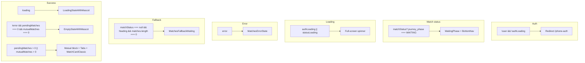

# State → UI Map

Tydlig dokumentation av vilken state som visar vilken layout i appen. Uppdatera när nya states eller sidor läggs till.

---

## Matches (`src/pages/Matches.tsx`)

| State | Villkor | Komponent / vy |
|-------|--------|-----------------|
| Redirect | `!user && !authLoading` | Navigate till `/phone-auth` |
| Waiting (journey) | `matchStatus?.journey_phase === 'WAITING'` | WaitingPhase + BottomNav |
| Auth/status loading | `authLoading \|\| statusLoading` | Full-screen spinner |
| Error | `error` | MatchesErrorState (CardV2 + Mascot + retry) |
| Fallback waiting | `matchStatus === null && !loading && matches.length === 0` | MatchesFallbackWaiting (WaitingPhase) |
| Loading | `loading` | LoadingStateWithMascot |
| Empty | `!error && pendingMatches.length === 0 && mutualMatches.length === 0` | EmptyStateWithMascot |
| Success | Annars | Ömsesidiga-block + filter-tabs + MatchCardClassic |

### Flöde (mermaid)

---

## Chat (`src/pages/Chat.tsx`)

| State | Villkor | Komponent / vy |
|-------|--------|-----------------|
| Redirect | `!user && !loading` | Navigate till `/phone-auth` |
| List-vy | `selectedMatch === null && selectedGroup === null` | MatchList / GroupChatRoom-list, tabs (chatt / samling), OnlineBannerV2, InputSearchV2 |
| 1:1-chatt | `selectedMatch !== null` | ChatWindow |
| Gruppchatt | `selectedGroup !== null` | GroupChatRoom |
| Inkommande samtal | `incomingCall !== null` | IncomingCallNotification |
| Video | `videoCallActive` | VideoChatWindow |

---

## Profile (`src/pages/Profile.tsx`)

| State | Villkor | Komponent / vy |
|-------|--------|-----------------|
| Redirect | `!user` | Navigate till `/phone-auth` |
| Loaded | `user` | ProfileView / ProfileEditor, CardV2, ButtonPrimary/ButtonGhost |

---

## Relaterade filer

- **Showcase → Live:** Se planen i `.cursor/plans/` (Showcase-to-Live and State-UI Map) för migrationsordning och komponent-ersättningar.
- **Designsystem:** `docs/DESIGN_SYSTEM.md`, `src/components/ui-v2/`.
